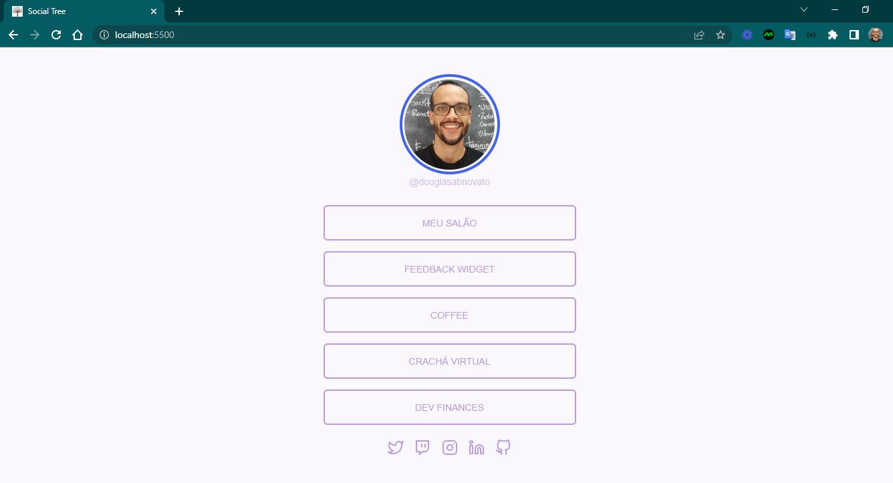
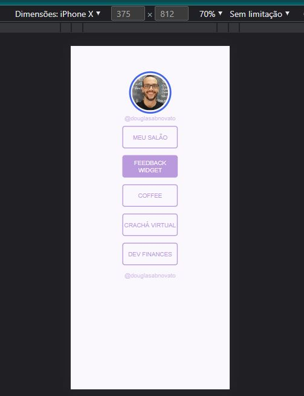

<h4 align="center"> 
	🚧 Social Tree 🚀
</h4>

<p align="center" style="display: flex; align-items: flex-start; justify-content: center;">
  
</p>  

### 💻 Sobre o desafio

Neste desafio você deve criar uma página com uma lista de links (menu) que pode ser usada em perfis de redes sociais para direcionar o usuário para o local escolhido. Utilizando HTML e CSS.

#### 💻 Techs

- Nível de dificuldade: Iniciante
- Tecnologias: html, css

#### 💻 Como começar?

1 - Use o link do [Figma](https://www.figma.com/file/1D14ToyJz8o77ZOal6jbGI/DD-%2F-Social-links-(Copy)) como base para o projeto. Também disponibilizamos para download todos os assets necessários (imagens e ícones), para fazer o download basta clicar no link acima.  

2 - Leia com atenção todas as instruções do desafio.

3 - Bora codar! Lembre-se que você pode usar as tecnologias que se sentir mais confortável, mas também pode se desafiar usando novas techs, fazendo modificações e/ou adicionando funcionalidades no projeto como preferir. 🚀

4 - Compartilhe seu resultado ou tire suas dúvidas na nossa [**comunidade aberta**](https://discord.gg/bacwY2gDCF)

### 💡 Conteúdos Aplicados

Neste desafio você vai construir uma página com uma lista de links. Caso você ainda não tenha feito os cursos do Discover ou queira fazer uma revisão, segue abaixo uma lista dos cursos que podem te ajudar a resolver este desafio.

#### 💡 [Guia Estelar de HTML](https://app.rocketseat.com.br/discover/course/o-guia-estelar-de-html)
O conteúdo esclarece plugin de preview HTML, tags, atributos, semântica, listas, abreviações, listas, representação de código, URLs, diretórios, tabelas, THead, TBody, colgroup, cabeçalho, meta, favicon, meta SEO e meta social.

#### 💡 [Guia Estelar de CSS](https://app.rocketseat.com.br/discover/course/o-guia-estelar-de-css)
O conteúdo aborda anatomia, seletores, box model, cascata, especificidade, shorthand, funções, devTools e vender prefixes.

### 🚀 [Requisitos do projeto](https://efficient-sloth-d85.notion.site/Desafio-Social-Tree-a4008e467a3248c4b05c97cf78aea44f)

#### 🚀 Requisitos para o desafio 

- [ ] Adicione uma imagem de perfil
- [ ] Adicione uma lista de links que pode ser usada para enviar o usuário para outros sites
- [ ] Opcional: Adicione ícones com links para outras redes sociais
- [ ] **Dica:** para centralizar o conteúdo você pode adicionar um elemento (div) com uma largura fixa e depois adicionar `margin: 0 auto`
- [ ] Você poderá usar como modelo o layout do Figma disponibilizado acima.

### 🎨 Style Guide

#### 🎨 Cores

- Templates de referências para ser feito

<p align="center" style="display: flex; align-items: flex-start; justify-content: center;">
  
  
</p>  

````css
:root {
  --body-bg-color: #FAF7FD;
  --purple: #BB99DD;
}
````

#### 🎨 Fontes

- [x] font-family: Poppins 
- [x] Font Weight: 300 e 600
- [x] Você pode encontrar a fonte no [Google Fonts](https://fonts.google.com/) 

### 📅 Entrega

Após concluí-los, adicionar esses códigos ao seu Github é uma boa forma de demonstrar seus conhecimentos para oportunidades futuras.

#### 📅 Tarefas

- [x] Organizando os detalhes do projeto no readme.md
- [x] Uma branch main e uma developer
- [x] Favicon
- [ ] [Learn Responsive Design](https://web.dev/learn/design/)
- [ ] [Learn CSS](https://web.dev/learn/css/)

#### 📅 Telas

- Desktop

<p align="center" style="display: flex; align-items: flex-start; justify-content: center;">
  
</p>  

- Mobile

<p align="center" style="display: flex; align-items: flex-start; justify-content: center;">
  
</p>  

Feito com ❤️ por Douglas A B Novato. 👋🏽 [Entre em contato!](https://www.linkedin.com/in/douglasabnovato/)
 
Fonte do projeto na [Rocketseat](https://www.rocketseat.com.br/). 👋 Participe da [comunidade aberta](https://discord.gg/bacwY2gDCF)!
